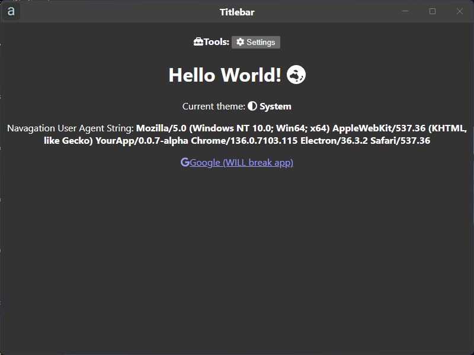
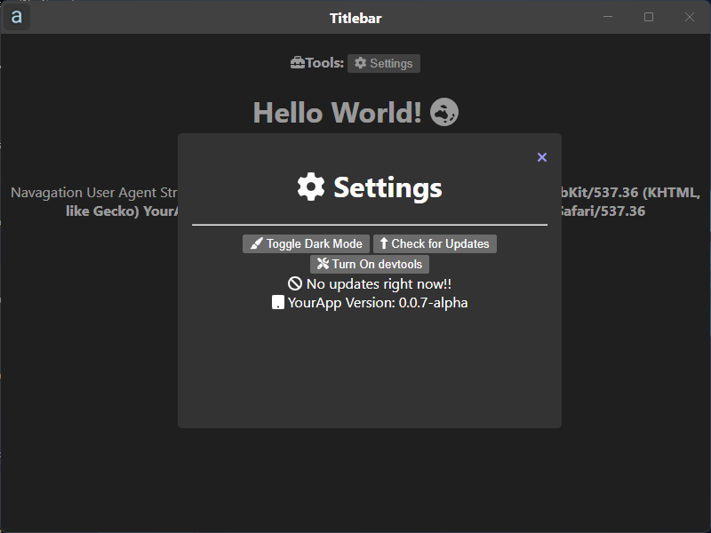

<h1> YourApp</h1>

This is my first app that I have tried using the electron-updater feel free to clone or fork this repo

Install modules: <code>npm install</code>

If you want to run this: 
<code>npm run start</code>
or build:
<code>npm run build</code>

<h2>Screenshots</h2>

<h2>❤️Credits</h2>

Thank you to electron for the dark theme example

Thank You to the Font Awersome team for Font Awersome!!
