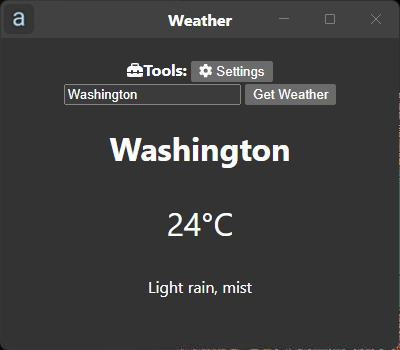
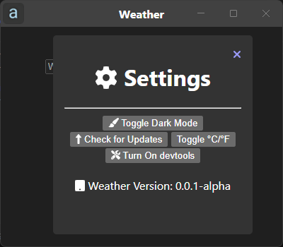

<h1> YourApp</h1>

This is my first weather that I have made

Install modules: <code>npm install</code>

If you want to run this: <code>npm run start</code> 
Build for Windows: <code>npm run build</code>
 Build for Macos: <code>npm run build-m</code>
 Build for Linux: <code>npm run build-l</code>
 Build for Windows On ARM: <code>npm run build-w-arm</code>

<h2>Screenshots</h2>

<h2>❤️Credits</h2>

Thank you to electron for the dark theme example

Thank You to the Font Awersome team for Font Awersome!!
